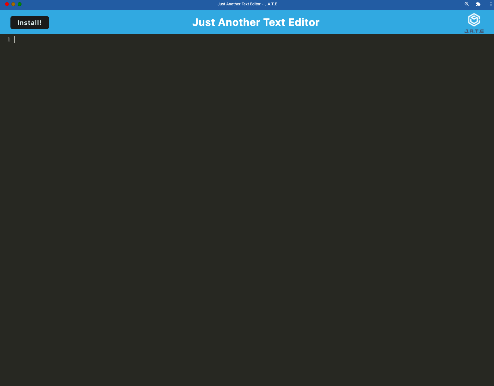

# PWA-Text-Editor
Bootcamp Challenge 19

## Application Description

This is a Progressive Web Application (PWA) Text Editor. Since this application is a PWA, it enables users to install the device locally. The Text Editor allows users to write code and save it for later use, which could be really useful if you don't have access to the internet.

I hope you enjoy my application. 

## Preview

Here is preview of the deployed application. 

## Links 

https://github.com/ndifiori/PWA-Text-Editor
